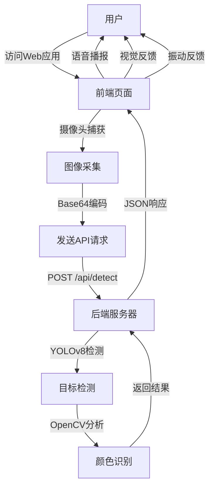

# 绿灯行 - 盲人过马路引导工具 Code Wiki

## 1. 项目概述

"绿灯行"是一个专为视障人士设计的红绿灯识别辅助工具，通过摄像头实时检测交通信号灯状态，并通过语音播报和视觉反馈帮助用户安全过马路。

### 主要功能
- 实时摄像头预览与红绿灯检测
- 智能识别红绿灯颜色状态（红、绿、黄）
- 语音播报识别结果
- 振动反馈提示
- 自动识别模式（持续检测）
- 响应式设计，适配手机屏幕

## 2. 项目架构

### 2.1 系统架构



### 2.2 技术栈

| 类别 | 技术/库 | 用途 |
|------|---------|------|
| 前端 | HTML5, CSS3, JavaScript | 用户界面与交互 |
| 后端 | Python, Flask | 服务器与API |
| 计算机视觉 | Ultralytics YOLOv8 | 目标检测 |
| 图像处理 | OpenCV (cv2) | 颜色分析 |
| 前端API | MediaDevices API | 摄像头访问 |
| 前端API | SpeechSynthesis API | 语音播报 |
| 前端API | Vibration API | 振动反馈 |

## 3. 核心模块

### 3.1 后端服务器 (server.py)

后端服务器基于Flask框架，主要负责：
- 提供Web应用入口
- 接收并处理前端发送的图像
- 使用YOLOv8模型检测交通信号灯
- 分析交通信号灯颜色
- 返回识别结果

#### 关键函数

| 函数名 | 功能 | 参数 | 返回值 |
|--------|------|------|--------|
| `analyze_traffic_light_color` | 分析红绿灯颜色 | image: 图像数据<br>box: 边界框坐标 | 颜色字符串, 置信度 |
| `detect` | 处理检测请求 | 无（从request获取数据） | JSON响应 |
| `health` | 健康检查接口 | 无 | JSON状态信息 |

#### API接口

| 路径 | 方法 | 功能 | 请求体 | 响应 |
|------|------|------|--------|--------|
| `/` | GET | 返回主页面 | N/A | HTML页面 |
| `/api/detect` | POST | 检测红绿灯 | `{"image": "base64编码的JPEG图片"}` | `{"detected": bool, "color": str, "confidence": float, "boxes": list}` |
| `/api/health` | GET | 健康检查 | N/A | `{"status": "ok", "model": "yolov8n"}` |

### 3.2 前端应用 (绿灯行真实版.html)

前端应用是一个单页面Web应用，主要负责：
- 提供用户界面
- 访问摄像头并捕获图像
- 发送图像到后端API
- 处理并展示识别结果
- 提供语音播报和振动反馈
- 管理用户设置

#### 核心功能模块

| 模块 | 功能 | 关键函数 |
|------|------|----------|
| 摄像头管理 | 访问和控制摄像头 | `initCamera()`, `captureFrame()` |
| API通信 | 与后端服务器交互 | `sendToAPI()`, `handleAPIResult()` |
| 结果处理 | 处理并展示识别结果 | `showResult()`, `colorToResultType()` |
| 语音播报 | 播放识别结果 | `speak()` |
| 振动反馈 | 提供振动提示 | 通过navigator.vibrate() |
| 设置管理 | 管理用户偏好设置 | `setupToggle()`, 相关事件处理 |

## 4. 关键算法与实现

### 4.1 红绿灯检测

1. **目标检测**：使用YOLOv8n模型检测图像中的交通信号灯（COCO数据集中的class ID为9）
2. **颜色分析**：
   - 裁剪检测到的红绿灯区域
   - 转换到HSV颜色空间（更适合颜色判断）
   - 定义红、绿、黄三色的HSV范围
   - 计算各颜色像素占比
   - 根据占比确定主色调

### 4.2 前端交互流程

1. **初始化**：加载页面，显示引导页
2. **摄像头访问**：用户点击开始使用后，请求摄像头权限
3. **图像捕获**：用户按住识别按钮时，捕获摄像头画面
4. **发送请求**：将图像转换为Base64编码并发送到后端
5. **处理响应**：接收后端返回的识别结果
6. **结果反馈**：
   - 更新UI显示结果
   - 播放语音播报
   - 提供振动反馈
7. **自动模式**：持续按住时，每隔2秒自动重复检测

## 5. 依赖关系

### 5.1 后端依赖

| 依赖 | 版本/来源 | 用途 | 安装命令 |
|------|-----------|------|----------|
| Flask | PyPI | Web服务器框架 | `pip install flask` |
| Ultralytics | PyPI | YOLOv8模型 | `pip install ultralytics` |
| OpenCV | PyPI | 图像处理 | `pip install opencv-python` |
| NumPy | PyPI (依赖) | 数值计算 | 自动安装 |

### 5.2 前端依赖

| 依赖 | 来源 | 用途 |
|------|------|------|
| Noto Sans SC | Google Fonts | 中文字体 |
| 浏览器API | 浏览器内置 | 摄像头访问、语音合成、振动 |

## 6. 项目运行

### 6.1 环境要求

- Python 3.7+
- 现代Web浏览器（支持MediaDevices API）
- 网络连接（前后端通信）
- 摄像头设备

### 6.2 安装与运行步骤

1. **安装依赖**：
   ```bash
   pip install flask ultralytics opencv-python --break-system-packages
   ```

2. **启动服务器**：
   ```bash
   python server.py
   ```

3. **访问应用**：
   - 本机访问：http://localhost:5000
   - 手机访问：http://<电脑IP>:5000（确保手机和电脑在同一WiFi网络）

### 6.3 运行状态

服务器启动后，会显示以下信息：

```
==================================================
  绿灯行 - 红绿灯识别服务器
==================================================

  本机访问: http://localhost:5000
  手机访问: http://<电脑IP>:5000

  确保手机和电脑在同一个WiFi下
  按 Ctrl+C 停止服务器
==================================================
```

## 7. 项目结构

```
盲人过马路引导工具/
├── server.py             # 后端服务器代码
├── 绿灯行真实版.html      # 前端Web应用
├── 绿灯行原型Demo.html   # 原型演示（可能为旧版本）
├── 绿灯行小程序产品方案.md  # 产品方案文档
├── 绿灯行小程序发布任务清单.md # 发布任务清单
├── 盲人红绿灯识别小工具可行性速析.md # 可行性分析
├── 盲人过马路辅助工具市场可行性分析报告.md # 市场分析
└── 绿灯行Demo.zip        # 演示压缩包
```

## 8. 关键类与函数

### 8.1 后端关键函数

#### `analyze_traffic_light_color(image, box)`

**功能**：分析检测到的红绿灯区域的颜色

**参数**：
- `image`：图像数据（OpenCV格式）
- `box`：边界框坐标 [x1, y1, x2, y2]

**返回值**：
- 颜色字符串："red" / "green" / "yellow" / "unknown"
- 置信度：0.0-1.0之间的浮点数

**实现细节**：
- 裁剪红绿灯区域
- 转换到HSV颜色空间
- 计算红、绿、黄三色的像素占比
- 根据占比确定主色调
- 基于占比计算置信度

#### `detect()`

**功能**：处理前端发送的检测请求

**请求体**：
```json
{"image": "base64编码的JPEG图片"}
```

**响应**：
```json
{
  "detected": true,        // 是否检测到红绿灯
  "color": "green",       // 红绿灯颜色
  "confidence": 0.85,      // 置信度
  "boxes": [               // 检测到的所有红绿灯
    {
      "x1": 100.5,
      "y1": 50.2,
      "x2": 150.8,
      "y2": 120.3,
      "detection_confidence": 0.92,
      "color": "green",
      "color_confidence": 0.92
    }
  ]
}
```

### 8.2 前端关键函数

#### `initCamera()`

**功能**：初始化摄像头并开始预览

**实现细节**：
- 检查浏览器是否支持MediaDevices API
- 请求摄像头权限
- 设置摄像头参数（使用后置摄像头）
- 处理摄像头错误

#### `captureFrame()`

**功能**：从摄像头捕获一帧图像并转换为Base64编码

**返回值**：
- Base64编码的图像数据（去除data URL前缀）

#### `sendToAPI(base64Data)`

**功能**：将捕获的图像发送到后端API进行检测

**参数**：
- `base64Data`：Base64编码的图像数据

**实现细节**：
- 构建POST请求
- 设置超时处理
- 处理响应结果
- 错误处理

#### `handleAPIResult(data)`

**功能**：处理后端返回的检测结果

**参数**：
- `data`：后端返回的JSON数据

**实现细节**：
- 解析检测结果
- 处理信号变化（如绿变红、红变绿）
- 生成语音播报文本
- 调用showResult显示结果

#### `showResult(resultType, speechText, confidence)`

**功能**：显示检测结果并提供反馈

**参数**：
- `resultType`：结果类型（green/red/yellow/gray）
- `speechText`：语音播报文本
- `confidence`：置信度

**实现细节**：
- 更新UI显示
- 播放语音播报
- 提供振动反馈
- 处理自动模式

## 9. 配置与部署

### 9.1 服务器配置

- **主机**：0.0.0.0（允许局域网访问）
- **端口**：5000
- **调试模式**：关闭

### 9.2 模型配置

- **模型**：YOLOv8n（轻量级模型，适合实时检测）
- **交通灯类别ID**：9（COCO数据集标准）

### 9.3 前端配置

- **摄像头设置**：
  - 朝向：环境相机（后置摄像头）
  - 分辨率：理想640x480
- **识别参数**：
  - 扫描间隔：2000ms
  - API超时：3000ms
  - 置信度阈值：0.3

## 10. 故障排查

### 10.1 常见问题

| 问题 | 可能原因 | 解决方案 |
|------|----------|----------|
| 摄像头不可用 | 权限未授予 | 在浏览器中允许摄像头权限 |
| 摄像头被占用 | 其他应用正在使用 | 关闭其他使用摄像头的应用 |
| 识别超时 | 网络延迟或服务器负载 | 检查网络连接，确保服务器正常运行 |
| 无法检测到红绿灯 | 角度不当或光线问题 | 调整手机角度，确保红绿灯在画面中清晰可见 |
| 颜色识别错误 | 光线条件或角度问题 | 调整手机位置，确保光线充足且红绿灯清晰 |

### 10.2 日志与调试

- 前端控制台：可查看JavaScript错误和API请求/响应
- 后端控制台：可查看服务器运行状态和模型加载信息

## 11. 未来改进方向

1. **模型优化**：
   - 训练专门针对交通信号灯的模型，提高识别准确率
   - 支持更多场景和天气条件

2. **功能扩展**：
   - 添加行人过街信号识别
   - 增加语音导航功能
   - 支持更多语言

3. **性能优化**：
   - 减少API响应时间
   - 优化前端图像处理

4. **部署改进**：
   - 打包为移动应用
   - 云端部署，减少本地服务器依赖

5. **用户体验**：
   - 增加更多个性化设置
   - 优化语音提示和振动反馈

## 12. 安全考虑

1. **权限管理**：
   - 仅请求必要的摄像头权限
   - 不在服务器存储用户图像

2. **数据隐私**：
   - 图像处理仅在本地和服务器内存中进行
   - 不持久化存储用户数据

3. **网络安全**：
   - 建议在安全网络环境下使用
   - 未来可考虑添加HTTPS支持

## 13. 结论

"绿灯行"项目通过结合计算机视觉和Web技术，为视障人士提供了一种实用的交通信号灯识别工具。系统架构清晰，功能完整，交互友好，能够有效帮助视障人士安全过马路。

项目采用模块化设计，前端和后端分离，便于维护和扩展。通过YOLOv8模型和OpenCV图像处理，实现了实时、准确的红绿灯识别。前端通过现代Web API提供了良好的用户体验，包括语音播报和振动反馈。

未来，通过持续优化模型和扩展功能，"绿灯行"有望成为视障人士出行的重要辅助工具，为他们的生活带来更多便利。