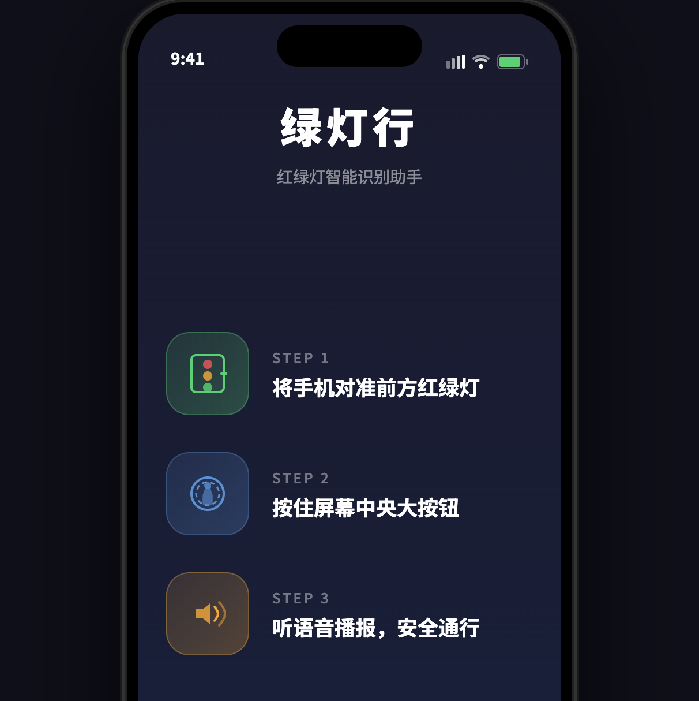
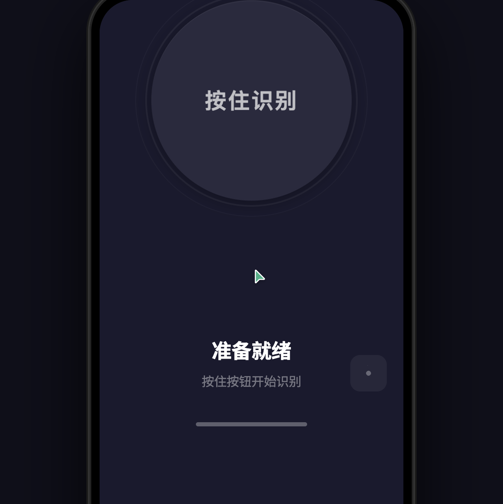
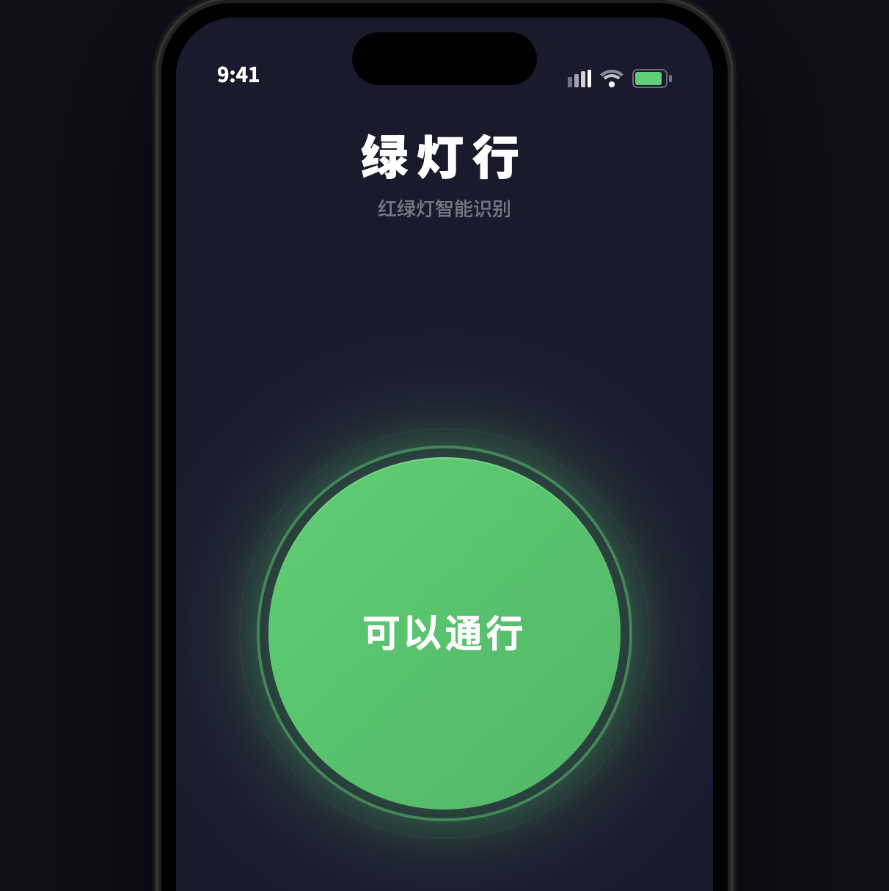
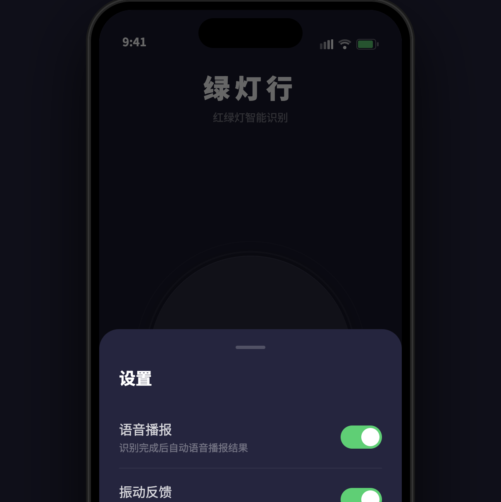

# 【More than Coding】刷到盲人过马路差点被撞，我用 SOLO 2小时做了一个AI红绿灯识别工具

## 摘要

刷短视频看到盲人过马路的画面，触动了我。用 TRAE SOLO 从一个念头出发，2小时完成了市场调研、产品设计、可交互原型、四轮代码评审、真实AI接入的全流程。

## 背景

我不是开发者。有天刷短视频，看到一个人举着盲杖站在车来车往的路口，完全不知道红绿灯是什么状态，只能等路人一起走才敢过。我就想：能不能用AI帮他们"看"红绿灯？

## 实践过程

### 第一步：这事有人做过吗？

让 SOLO 调研了一圈，结论是：有人做，但没做好。

- 高德视障导航靠数据"猜"红绿灯，不是真的在看
- 微软 Seeing AI 能识别但不是为过马路设计的
- OrCam 硬件效果好但卖1万6，盲人买不起

**痛点真实，但没人做好。**

### 第二步：技术上能不能做？

SOLO 的判断：能做，但有难点——远距离红绿灯只有几个像素、强光逆光下容易失效、复杂路口多灯难分辨。不过 YOLOv8 轻量模型在手机上跑得动，基本识别没问题。

### 第三步：产品怎么设计？

我提了一个要求：极简，盲人零学习成本。

SOLO 的方案：**就一个大按钮，按住识别，松开停止。**

然后它做了一件让我意外的事——**自己审了自己的方案，发现4个问题并自动修复。** 比如没考虑"持续按住时信号变了怎么办"，自己加了防抖机制。

### 第四步：做个能点的原型

SOLO 生成了一个HTML文件，打开就能用：模拟手机外框、3步引导页、大按钮、语音播报、振动反馈、无障碍适配。按住按钮会模拟识别并播报结果。

### 第五步：让SOLO自己审自己的代码

我让 SOLO 扮演高级开发、高级算法、高级测试、高级产品四个角色联合评审。

**第一轮挑出5个严重问题**：定时器管理不当、延迟指标不切实际、漏了"正在识别"语音播报等。全部自动修复。

第二轮通过（A- 90分），第三轮通过（A 92分）。

**但最有意思的是后面的事。** 测试时 SOLO 发现"鼠标松开后结果消失"，自作主张改成了"延迟3秒消失"。我指出这不对——盲人过马路需要持续监测，松开就该立即停止。SOLO 马上认可并回滚。

它不是在机械地修bug，而是在思考产品场景。虽然这次想错了，但被纠正后能立刻理解。

### 第六步：接入真实AI

最后把模拟数据换成真实识别。SOLO 写了两个文件：

- **server.py**：Flask + YOLOv8 后端，接收截图返回红绿灯颜色
- **真实版.html**：调用手机后置摄像头，每2秒截图识别，语音播报结果

## 成果展示

**GitHub 仓库**：https://github.com/jinqianfei/green-light-go

### 浏览器测试截图

**引导页**：3步引导 + 免责声明，盲人也能听懂



**主页面**：一个大按钮，按住识别，松开停止



**识别中**：按钮脉冲动画 + 摄像头实时预览



**设置面板**：语音/振动/自动识别三个开关，Escape键可关闭



### 项目文件

| 文件 | 内容 |
|------|------|
| 可行性速析.md | 竞品、技术、商业、成本四维分析 |
| 产品方案.md | 完整产品设计，3轮迭代 |
| 原型Demo.html | 可交互原型，4轮评审达A级 |
| 真实版.html + server.py | 接入真实AI，手机可直接运行 |
| 发布任务清单.md | 36个任务，从注册到上线 |

```bash
pip install flask ultralytics opencv-python
python server.py
# 手机打开 http://电脑IP:5000
```

## 效果与总结

这件事给我最大的感触不是"AI能写代码"，而是**AI能帮你完成一整套思考链条**——从调研、设计、开发到测试迭代，每个环节都能参与，而且会主动发现问题。

当然它也会翻车（延迟重置那件事），但被纠正后能马上理解为什么错，这比单纯执行指令更有价值。

光调研+方案传统方式可能要一两周，SOLO 两小时跑完全流程。**不是说做得完美，而是让你能以极低的成本验证一个想法行不行得通。**

行不通，两小时换来的教训。行得通，你就有了继续做的底气。
